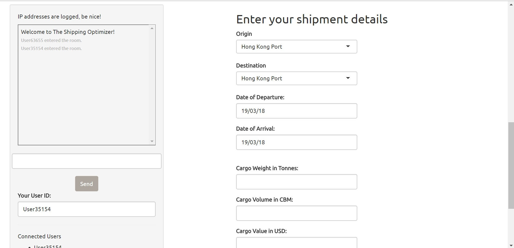
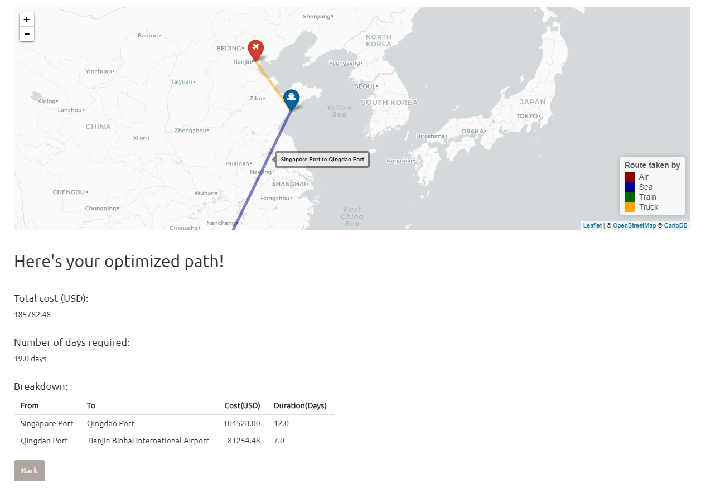

# The Shipping Optimizer
Developed for submission to Y3 - NUS Business Analytics Innovation Challenge 2018.

Cross border multi-modal shipments face inefficiencies in costs and duration due to poor linkages between transport modes.

The Shipping Optimizer is a tool for shippers to find the most cost-saving route for their shipment (includes multiple variables like cargo weight and value). 

Future implementations could possibly include:
A more secure chat platform for shippers to discuss cargo-sharing.
Blockchain implementation for real-time updates and transparency on location/price of shipment.

See:
http://bit.ly/2G5VrBi
or (if above doesn't work)
https://jasonyip184.shinyapps.io/theshippingoptimizer/

